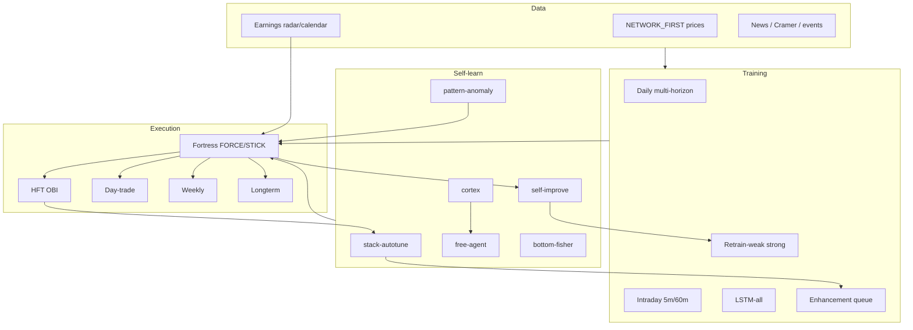

# MASTER ALL-ALGORITHMS PLAN — FATE_AlgoBot

Updated: 2026-07-30 ~04:00 UTC (2026-07-29 evening PT)  
Standing rules: **optimize, never remove** · full universe · `NETWORK_FIRST=true` · never delete `models/` · edits locked until talk 1B · Pacific time.

**Honesty:** no P&L is guaranteed. “~30% tomorrow” is an ambition to maximize sticky high-conviction edge under **10% single-name caps** and PDT discipline — not a fake guarantee.

Related live docs: `TOMORROW_30_PLAN.md`, `MODEL_QUALITY_AUDIT.md`, `STICK_LOCKIN_NOTES.md`, `deploy_scale.env`.

---

## 0. Current lock-in snapshot (refresh often)

| Metric | Value |
|--------|------:|
| Equity / cash | ~$75.4k / ~$46.1k |
| Positions | IWM, QQQ, SPY (~10% each, **no rebuy**), SBUX ~9.5% **HOLD** |
| BX | Model on disk; **not held** — FORCE on next valid UP |
| Talk | ~4.91% of 1B · edits OFF |
| Models disk | ~11–12 GB (climbing) · free disk ~16–17 GB |
| Daily / intra / LSTM coverage | ~11% / ~23% / ~36% of 11,959 universe |
| FORCE path | LIVE — logs show `FORCE STICK` (e.g. ABBV, ETN) + `FORCE PRED` (SBUX) |

Risk caps (do not loosen casually): `MAX_SINGLE_ASSET_FRAC=0.10`, index bans ON, add-on/DCA OFF, monthly DD halt 20% ON, micro-scalp paused.

---

## 1. Tonight → tomorrow RTH (edge toward 30% ambition)

### Goal
Deploy idle cash into **sticky singles** at open, not index ETF spam. Hit FORCE/STICK when `p_up` / earnings stick fires. Preserve SBUX. Buy BX if conviction UP. Stay inside 10%/name and ~55% target deploy.

### Why 30% portfolio in one day is hard (and still how we aim)
- Cap ≈ $7.5k/name → one +30% name ≈ **+3% portfolio**, not +30%.
- Realistic aggressive path: **several** sticky winners (FORCE list + earnings day-ofs) + underdeployed cash → correlated upside day. Markets can refuse.

### Pipeline at open (all sleeves)

```
data (Yahoo/Alpaca NETWORK_FIRST)
  → features (schema v2, earnings, events, math gates)
  → models (daily / intraday / LSTM / meta)
  → signals (pred UP, earnings stick, Cramer, pattern, imbalance, cross-link)
  → FORCE / STICK priority (pin ahead of rotation)
  → execution:
       fortress/intraday  ·  HFT OBI  ·  day-trade
       weekly (5d)  ·  longterm (20d)
```

### Concrete RTH actions
1. Pre-open: `./run_all.sh status` — fortress, OBI, day-trade, weekly, longterm, watchdog all RUNNING.
2. Confirm `force_buy_watch` loaded (log: `force_buy_watch: BX,SBUX,…`).
3. Expect log lines: `FORCE PRED BUY` / `FORCE STICK BUY` — not watch-only.
4. Do **not** add SPY/QQQ/IWM; hold SBUX unless hard risk exit.
5. Day-trade only via `./run_all.sh ensure-day-trade`.
6. After first hour: `./run_all.sh trade-reasons` + `verify-trades`.

### Symbol focus
| Tier | Symbols | Action |
|------|---------|--------|
| Must | BX, SBUX | FORCE if UP; SBUX hold |
| Cramer / quality | COST, WMT, NOW, CRM, JNJ | FORCE scan ≤10% |
| Core singles | AAPL, MSFT, NVDA, AMD, META, AMZN, AVGO, GOOGL, NFLX, TSLA | Pred force + HFT whitelist |
| Earnings radar | Calendar near 2026-07-30 (verify hour live) | STICK if encourage window |

---

## 2. Next 7 days — finish models + talk climb

Universe stays **11,959**. No shrinking to “finish faster.”

| Day (PT) | Training focus | Trading / self-learn |
|----------|----------------|----------------------|
| D0 night (now) | train-gaps letter_rr, train-intraday gap, LSTM-all, enhancement-queue **full**, retrain-weak @ 0.60/0.55, priority FORCE names | All trade heads UP; FORCE/STICK; talk overnight + reward |
| D1 RTH | Keep trainers behind trading; no pause-all | Sticky deploy; stick hit-rate log |
| D1 night | Continue failed-retry + intraday backlog; letter fairness | Self-improve / autotune / cortex feed |
| D2–D3 | Top100 weak perfection until clear; top50pct intraday+LSTM backlog | Weekly/longterm bias from improved heads |
| D4–D5 | Remaining daily gaps (letter_rr); LSTM-all climb toward full | Earnings radar refresh; force list refresh |
| D6–D7 | Proper-finish queue advance; re-audit quality | Review stick hit-rate vs missed UP |

### Training commands (resume-safe)
```bash
export NETWORK_FIRST=true KEEP_WATCHDOG_ON_STOP=true
./run_all.sh ensure-training
./run_all.sh retrain-weak-until
./run_all.sh train-gaps          # if gaps idle
# LSTM-all via enhancement-queue / train-lstm — already scoped all
# Talk:
caffeinate -dims bash ./tools/overnight_talk_trillion.sh &
# Reward (optional parallel):
./venv/bin/python -u tools/train_talk_reward.py &
```

### Talk 1B gate
- Climb as far as overnight/7d allow; **do not claim 1B early**.
- `TALK_ALLOW_EDITS=false` until `problems_done >= 1e9` **and** env unlock.
- Resume after lid-close: `./tools/resume_massive_training.sh --continue`.

### Disk policy
- If free **< ~12 GB**: `./run_all.sh slim-disk` (caches/logs only).
- **Never** delete `models/` or skip phases to save space.

---

## 3. Algorithm map — how everything improves everything



| Loop | Role | Feeds |
|------|------|-------|
| enhancement-queue | Orchestrates finish phases (incl. LSTM-all) | train / progress ETA |
| retrain-weak-until | Strong search until top100 pass thresholds | better daily heads → fortress rank |
| stack-autotune | Runtime knobs from live behavior | fortress/HFT params |
| self-improve | Outcome → retrain / feature pressure | weak queue |
| cortex / free-agent | Higher-level exploration (safe, non-edit) | playbooks / signals |
| pattern-anomaly / bottom-fisher | Hidden structure / fish signals | rank boosts |
| paper-awake / hygiene / exec-monitor | Keep Mac/book/orders healthy | uptime + fill quality |
| stack-watchdog | Restart dead cores; KEEP_WATCHDOG_ON_STOP | all trade heads |
| talk harness + reward | Operator brain toward 1B | status/docs only until unlock |

---

## 4. Failure modes + keep-alive

| Failure | Symptom | Fix |
|---------|---------|-----|
| Fortress / OBI / day-trade STOPPED | status stopped | `ensure-intraday` / `ensure-subsecond` / `ensure-day-trade` — **not** `pause-all` |
| Watchdog killed by stop | cores die minutes later | `KEEP_WATCHDOG_ON_STOP=true`; `./run_all.sh stack-watchdog` |
| Hang thrash | fortress hang_kill | Heartbeat + `FORTRESS_HANG_IDLE_SEC=2400` |
| Missed sticky buy | pred UP, no fill; index filled slots | FORCE path ON; check `FORCE PRED/STICK` logs; force_buy_watch |
| Model purge race | `*_model.pkl` missing mid-FRESH | Prefer `tools/priority_force_train_once.py`; bak under `data/ops/` |
| Talk died | edit-gate stale / no harness pid | `caffeinate -dims bash ./tools/overnight_talk_trillion.sh` |
| Disk tight | free < 12G | `slim-disk` caches only |
| Train stalled | progress ETA frozen | `ensure-training`; check checkpoint; letter_rr gaps |
| Cross-sleeve wipe | HFT exit sells full broker qty | Sleeve-scoped closes (LOCKIN_PLAN P0) — verify registry |

### Nightly keepalive block
```bash
./run_all.sh ensure-intraday
./run_all.sh ensure-subsecond
./run_all.sh ensure-weekly
./run_all.sh ensure-longterm
./run_all.sh ensure-day-trade
./run_all.sh ensure-self-improve
./run_all.sh ensure-cortex
./run_all.sh ensure-free-agent
./run_all.sh ensure-paper-awake
./run_all.sh ensure-paper-hygiene
./run_all.sh ensure-execution-monitor
./run_all.sh ensure-training
./run_all.sh retrain-weak-until
./run_all.sh stack-watchdog
./run_all.sh status
./run_all.sh edit-gate
```

---

## 5. Success metrics (measure, don’t invent)

| Metric | Target direction | Source |
|--------|------------------|--------|
| Daily coverage % | ↑ toward full universe | `MODEL_QUALITY_AUDIT` / progress |
| Intraday / LSTM % | ↑ | same |
| Weak count (top100 @ 0.60/0.55) | ↓ to 0 | retrain-weak |
| Talk % of 1B | ↑ (no early unlock) | `edit-gate` |
| Equity / day PnL | improve vs SOD without blowing DD halt | Alpaca / `equity` |
| Stick hit-rate | FORCE PRED/STICK → actual buy when cash+cap allow | fortress logs + trade-reasons |
| Index rebuy count | **0** new SPY/QQQ/IWM | positions + bans |
| Process uptime | all core heads RUNNING overnight | `status` + watchdog |
| Models disk | grow toward proper finish; no deletions | `du -sh models` |

---

## 6. Automatic loops left running overnight

1. **stack-watchdog** — restart trade cores  
2. **enhancement-queue** — proper-finish phases  
3. **train / train-intraday / train-lstm** — gap + LSTM-all  
4. **retrain-weak-loop** — top100 strong perfection  
5. **talk overnight + massive harness + reward** — climb 1B  
6. **stack-autotune / self-improve / cortex / free-agent** — continuous learning  
7. **pattern-anomaly / bottom-fisher / universe-lifecycle / industry-ai** — intel + coverage  
8. **paper-awake / hygiene / execution-monitor / disk-cleanup** — ops hygiene  
9. **fortress + OBI + day-trade + weekly + longterm + hft-rotator** — live path for RTH  

Do **not** `pause-all` or kill trainers when bouncing a single trade head.

---

## 7. Operator one-liners

```bash
./run_all.sh status && ./run_all.sh edit-gate && ./run_all.sh progress
./run_all.sh trade-reasons BX
./run_all.sh verify-trades
tail -f logs/intraday_latest.log | rg 'FORCE|STICK|BAN'
```

When in doubt: **ensure-*, never shrink universe, never delete models, never fake P&L.**
