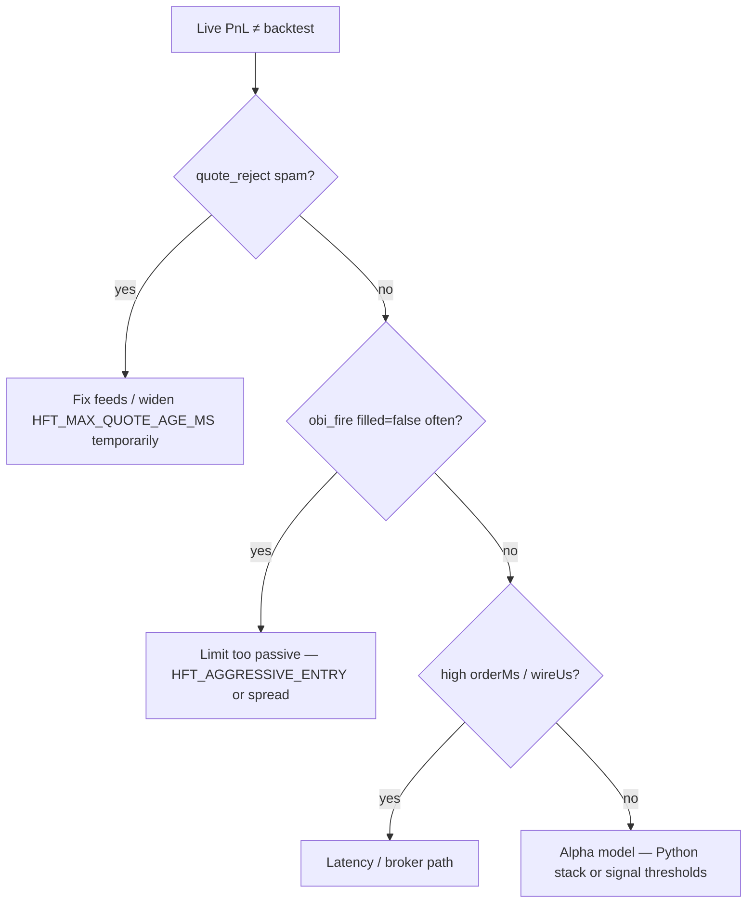

# Algorithmic accuracy debug checklist (FATE mapping)

Systematic guide to separate **software/data bugs** from **execution slippage** in this repo.

## 1. Deterministic backtesting

| Check | FATE status | Where |
|-------|-------------|-------|
| No look-ahead on daily signals | **Yes** — signal bar T−1 | `paper_sim_today.py`, `docs/DECISION_LOGIC.md` |
| Order-type fidelity (limit/IOC/market) | **Partial** — live TS models IOC/DAY; bar backtest differs | `hft/src/obi-tape/order-pricing.ts`, `tools/hft_scalper_backtest.py` |
| Tick / L2 replay through real signal code | **Gap** — bar proxy only in Python | `tools/hft_scalper_backtest.py` (not wired to `obi-tape`) |
| Fees in sim | **Partial** — paper-sim notes exclude fees | `paper_sim_today.py` |

**Action:** Compare `hft/logs/hft-*.jsonl` `obi_fire` / `mr_fire` events to bar backtest PnL — large gaps imply fill-model or latency issues, not alpha.

## 2. Data corruption & race conditions

| Check | FATE status | Where |
|-------|-------------|-------|
| Pre-allocated ring buffers | **Yes** | `hft/src/common/buffers.ts`, `l2-book.ts` |
| Single-threaded WS hot path | **Yes** (Node event loop) | `hft/src/obi-tape/index.ts` |
| Dirty / stale quote filter | **Yes** (new) | `hft/src/obi-tape/quote-health.ts` |
| Crossed-book reject | **Yes** | `quote-health.ts` |
| Price-shock reject (bad feed) | **Yes** — `HFT_MAX_MID_SHOCK_BPS` | `quote-health.ts`, `lastGoodMid` in `index.ts` |
| REST quote sanitize | **Yes** | `sanitizeRestQuote()` in `order-pricing.ts` |

**Env knobs:**

```bash
HFT_MAX_QUOTE_AGE_MS=2500      # drop quotes older than this
HFT_MAX_MID_SHOCK_BPS=500      # reject sudden mid jumps (bad packet)
HFT_SKIP_QUOTE_HEALTH=false    # disable only for debugging
```

**Logs:** `quote_reject` events in `hft/logs/hft-*.jsonl`.

## 3. Execution slippage (latency)

| Check | FATE status | Where |
|-------|-------------|-------|
| Packet → decision → order timestamps | **Yes** (OBI) | `obi_fire`: `packetNs`, `decisionNs`, `orderNs`, `procMs`, `decisionMs`, `orderMs` |
| Ingest → fire (earnings) | **Fixed** | `earn_fire`, `earnings-executor.ts` |
| Broker wire latency | **Yes** | `AlpacaExecutor.placeHist`, `wireUs` on fires |
| Pre-allocation on hot path | **Yes** | Typed arrays, frozen `CFG` |
| Binary protocols (SBE/ITCH) | **N/A** — Alpaca REST + WS JSON | Future colo upgrade |

**Interpretation:**

- High `decisionMs` → strategy logic too heavy (spread checks, news gates).
- High `orderMs` → broker HTTP or fill polling (`resolveOrderFill`).
- High `wireUs` with low `decisionMs` → network/colocation issue.

## 4. Shadow / simulated production

| Check | FATE status | Where |
|-------|-------------|-------|
| HFT dry-run | **Yes** | `HFT_DRY_RUN=true` |
| Realistic NBBO-cross sim fills | **Yes** (new) | `HFT_SIM_BROKER=true` (default with dry-run) |
| Legacy instant-fill dry-run | Opt-in | `HFT_SIM_BROKER_LEGACY=true` |
| Slippage on sim fill | **Yes** | `slippageBps`, `expectedFillPx` on `OrderResponse` |
| Python policy shadow | **Yes** — not broker | `self_modify/shadow_validator.py` |
| Fortress shadow broker | **Gap** | Use `USE_REAL_MONEY=false` (skips orders) |

**Rehearsal command:**

```bash
HFT_DRY_RUN=true HFT_SIM_BROKER=true npm run obi-tape
```

Compare `simFill`, `filled`, `slippageBps` in logs before enabling real orders.

## 5. HFT prediction stack (this codebase)

| Mechanism | Module |
|-----------|--------|
| Order book imbalance (OBI) | `l2-book.ts`, `obi-tape-signals.ts` |
| Tape velocity burst | `tape-velocity.ts` |
| Micro mean-reversion + JP candles | `micro-mean-reversion.ts`, `jp-candles.ts` |
| Earnings surprise | `earnings-evaluator.ts` |
| News gate | `trade-news.ts` |

These predict **milliseconds–seconds** order-flow edge, not multi-day direction (that's the Python daily model stack).

## Quick diagnosis flow


